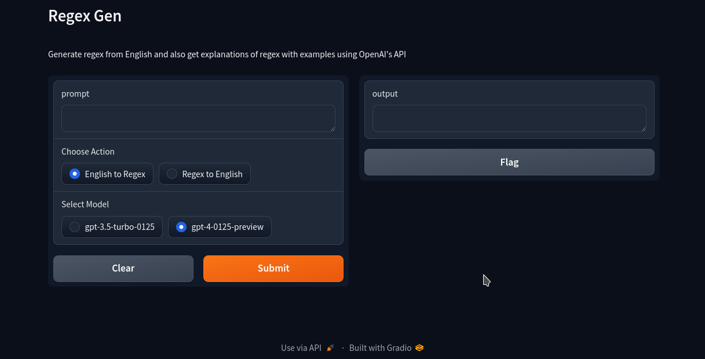

# regex-gen

Generate regex from English and also get explanations of regex with examples using OpenAI's API



## Installation

- Get your OpenAI API key from [here](https://platform.openai.com/api-keys) 

- fill it in the `.env` file

    ```bash
    mv .env.sample .env
    ```
    and open it in your editor of choice and paste the `API_KEY`

- install dependencies

    ```bash
    python3 -m pip install -r requirements.txt
    ```

- start the program
    ```bash
    python3 app.py
    ```

- open the link in the terminal to open the gradio web interface
